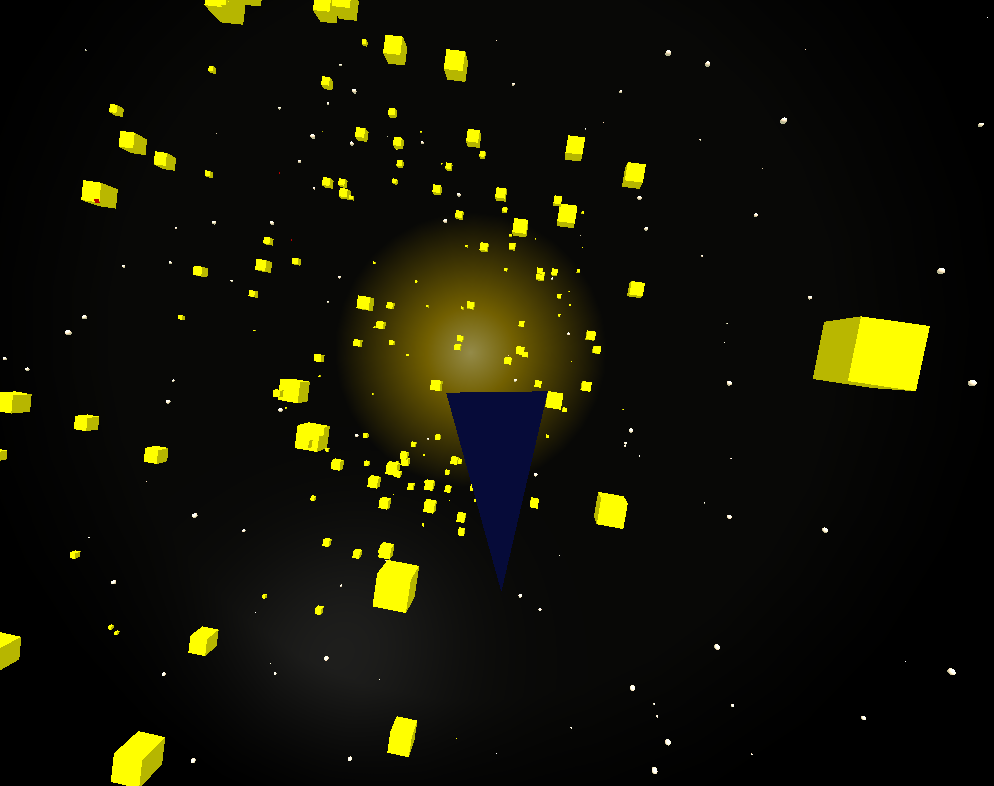
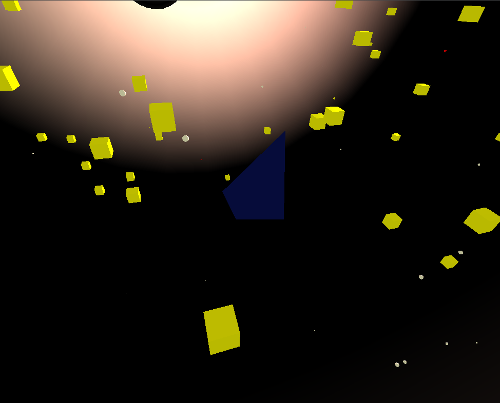
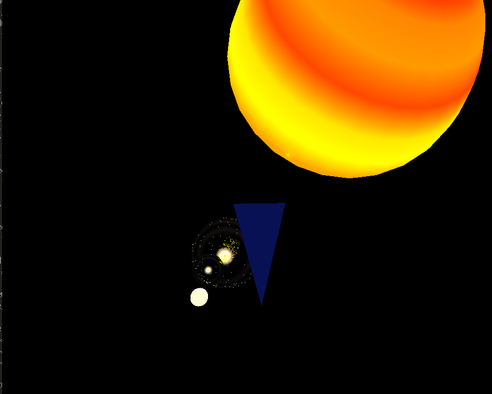

# Table of Contents

1.  [Descriptif général et consigne](#org720cd80)
2.  [Fonctionnalités attendues](#org2cab047)
3.  [Description du code source](#orge8321f9)
4.  [Le jeu](#orgf35894f)
5.  [Le milieu](#orgcad75bd)
6.  [La caméra](#orgfde637f)
7.  [Gameplay](#orgdd98119)
8.  [Compilation](#org5bc69ba)
9.  [Captures d'écran](#org229b9bd)
10. [Conclusion](#org46c7f98)

# Descriptif général et consigne

Ici, le joueur incarne le commandant d’équipage d’un navire marchand
explorant l’espace intergalactique. L’objectif principal du jeu est de dévelop-
per des liens commerciaux avec les différents individus / groupes / peuples
rencontrés mais le navire peut aussi bien être amené à combattre d’autres
équipages afin de se défendre ou défendre sa cargaison. Vous pouvez vous
inspirer des exemples suivants : Elite (Amiga) / Frontier : Elite 2.

# Fonctionnalités attendues

## DONE Piloter un vaisseau dans l’espace

## DONE Gérer l’éclairage en fonction des étoiles les plus proches

## TODO Détecter les collisions avec d’autres vaisseaux et/ou astéroides

## DONE Gérer différents points de vue

## TODO Gérer des modes combats

## TODO Faire du commerce / gérer le stock

## TODO Jouer en réseau

# Description du code source

## Repo git

<https://gitlab.com/sulfasTor/lucky_starr>

    .
    |___ shaders
    |__ |___ fragment.fs
    |__ |__ vertex.vs
    |__ src
        |___ common.h
        |___ quaternion.c
        |___ quaternion.h
        |___ space.c
        |___ space.h
        |___ utils.c
        |___ utils.h
        |___ vessel.c
        |___ vessel.h
        |__ window.c

## shaders

### fragment.fs et vertex.vs

Contiennent les shaders qui gèrent les vertex et pixels des éléments
graphiques. Ils gèrent aussi l'éclairage ambient, diffuse et spéculaire.

## src

### `common.h`

Contient des variables globales utilisées dans tout le programme.

### `quaternion.c`

Définit des opération mathématiques appliquées aux quaternions.

### `quaternion.h`

Fichier d'en tête de `quaternion.c`.

### `space.c`

Définit tout ce qui a un lien avec le milieu géographique (planètes,
étoiles, soleil, &#x2026;).

### `space.h`

Fichier d'en tête de `space.c`.

### `utils.c`

Fonction diverses utilisées dans tout le programme.

### `utils.h`

Fichier d'en tête de `utils.c`.

### `vessel.c`

Définit tout ce qui a un lien avec les corps en mouvement
(Vaisseaux, etc.)

### `vessel.h`

Fichier d'en tête de `vessel.c`.

### `window.c`

Gère l'animation et le jeu.

# Le jeu

Le jeu consiste simplement à explorer son environnement. Toutes les
foncionnalités attendues n'ont pas pus être implementées pour manque
de temps.

Le joueur est capable de bouger dans son milieu constitué d'un soleil
et deux planètes dont un contient une lune.

Le vaisseau contient deux points de vue: Vue de l'extérieur et de
l'intérieur du vaisseau. Pour la vue de l'extérieur une caméra
classique a été utilisé (pitch, yaw, roll). Pour la caméra de
l'intérieur du vaisseau une caméra "quaternion" a été utilisée.

Dans le programme aucune texture a été charge d'une image ni d'objet
`.obj`. Tout est crée dans le programme.

# Le milieu

Le milieu est constitué d'une étoile. Cette étoile est fixe dans
l'espace et devant contient l'origine de la source de lumière
spéculaire.

Deux planètes jumelles sont fixes aussi dans l'espace. Ces planètes
sont constitués de gaz ce qui permet de rentrer dans son centr.  La
texture à été définit dans un tableau de couleurs.

Une planète contient une lune qui orbite en dehors et dans la planète.
Elle contient aussi deux portails qui promènent des objets
non-identifiables dans la planète.

La deuxième planète est vide est plus froide à cause de sa distance du
soleil.

Dans la planètes ayant une lune des vaisseau ennemis se promènent dans
des orbites de surveillance.

# La caméra

Il existe deux types de caméra utilisées: une caméra classique et une
caméra quaternion.

## Classique

Cette caméra est utilisé pour la vue de l'extérieur qui montre le
vaisseau.
Cette caméra utilise les angles d'Euler pour décrire sa rotation.
On utilise aussi trois vecteur qui gardent les axes du "front",
"up" et "right" qui consituent un repère de trois vecteur
perpendiculaires suivant les axes x, y, z.

Les tranformation de repère à partir des angles sont définies par les
formules:

\(x_{front} = cos(yaw) * cos(pitch)\)
  
\(y_{front} = sin(pitch)\)
  
\(z_{front} = sin(yaw) * cos(pitch)\)

Ensuite le vecteur est normalisé.

Les vecteurs "up" et "rigtht" sont calculés grâce au produit
vectoriel et normalisés.

\(\vec{right} = \vec{front} \times \vec{up}\)
  
\(\vec{up} = \vec{right} \times \vec{front}\)

## Quaternion

Cette caméra est utilisé pour montre un point de vu plus restraint qui
est celui du pilote. Cette caméra utilise outil mathématique du
quaternion qui permet de garder des rotations. Un quaternion garde une
rotation. Une variation de rotation changera le quaternion sans perdre
la rotation courante. Cela facilite les calculs.

Grâce aux quaternion on peut calculer l'axe lors de l'application d'un
angle. Les autres axes seront déduits du produit vectoriel.
On peut ausse récupérer un quaternion à partir des angles d'Euler qui
utile pour la transition entre la caméra classique et la caméra
quaternion.

# Gameplay

A cause du manque de temps le gameplay est simple. Il s'agit
d'explorer l'environnement et de profiter de la jolie vue.
Le vaisseau peut se déplacer devant et dérrière. Il peut aussi faire
un grand saut dans l'espace avec une accélération "hyperspace".
Cependant le jeu contient quelques défauts:

## Pilotage

La caméra d'Euler a un inconvénient: Gymbal Lock ou le blocage de
cardan.

Cela provoque la perte d'un angle de liberté ce qui se traduit par des
rotation dans un axe différent de celui souhaité.  Cela peut se régler
par des quaternions mais pour manque de temps la caméra quaternion n'a
été utilisée que pour la vue de l'intérieur.

Aussi l'orientation du vaisseau n'est pas exacte. Ainsi le vaisseau
peut pointer vers l'utilisateur.

La rotation suivant l'axe z n'est pas subtil. Des angles de rotation
quantifiés sont perceptibles ce qui se traduit par des sauts de
rotation.

La caméra constitué l'un des plus grand défaut du jeux.

## Fonctionnalités non implémentées

Ce projet a constitué pour moi un défi. Pour manque de temps je me
suis arrêté à l'implémentation des tirs lasers qui n'a pas été finit
et donc non inclut dans le jeu.

## Commandes

    Z : Déplace le vaisseau devant.
    S : Déplace le vaisseau derrière.
    Q : Tourne à gauche le vaisseau dans l'axe de Z.
    D : Tourne à droite le vaisseau dans l'axe de Z.
    X : Quitte le jeu.
    H : Déplace le vaisseau d'une grande vitesse (Hyperspace).
    A : Change le point de vue.

# Compilation

Pour générer l'executable il suffit de faire un appel a `make`.
Les librairies utilisés sont celles de GL4D.

    #include <GL4D/gl4dg.h>
    #include <GL4D/gl4dp.h>
    #include <GL4D/gl4duw_SDL2.h>

Pour executer le jeu il faut taper:

    ./game

# Captures d'écran

# Conclusion

Ce jeu n'a pas atteint son objectif décrit dans les fontionnalités
attendues. Cependant il essaie de présenter à l'utilisater une jolie
scène en n'utilisant que les moyens du code (sans .OBJ ni images).

